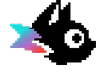

# Lynx Flappy Bird 

A cross-platform Flappy Bird vibe-coded with [Lynx](https://lynxjs.org/) — play it in a web browser or render it natively on mobile, same codebase, same feel.

The game engine, physics, and assets are shared across two editions that differ only in the UI-shell framework:

| Edition | Play it live | Source |
| --- | --- | --- |
| **ReactLynx** | [huangxuan.me/lynx-flappy-bird](https://huangxuan.me/lynx-flappy-bird/) | [`main` branch](https://github.com/Huxpro/lynx-flappy-bird/tree/main) |
| **Vue Lynx** | [preview on Vercel](https://lynx-flappy-bird-git-vue-huxpros-projects.vercel.app/) | [`vue` branch](https://github.com/Huxpro/lynx-flappy-bird/tree/vue) |

- 4 bird variants: **Lynx** (by Nanobanana), classic yellow, blue, and red — randomly picked each round along with day/night backgrounds
- Debug mode (long-press): live FPS counter, hitboxes, pipe gap zones, and MTS/BTS message LED indicators

## Why Lynx?

Building a real-time game on a UI framework is a stress test for input latency and animation smoothness. Most cross-platform approaches drive the game loop through the framework's reconciliation cycle (`setInterval` → state update → re-render), adding frame latency and jank. Lynx's dual-thread architecture lets us split concerns cleanly:

**[Main Thread Script](https://lynxjs.org/react/main-thread-script.html)** owns everything frame-critical — touch handling, physics, collision detection, pipe/ground scrolling, and bird animation all run on the main thread via `requestAnimationFrame`. Tap-to-flap has zero bridge round-trip; the game loop stays well within the 16ms frame budget.

**The background thread** owns the UI shell — score display, start screen, game-over panel, and the idle/playing/gameover state machine. These are low-frequency state transitions where a declarative model shines and bridge latency is invisible. The shell is implemented in both [ReactLynx](https://lynxjs.org/react) (on the [`main`](https://github.com/Huxpro/lynx-flappy-bird/tree/main) branch) and [Vue Lynx](https://vue.lynxjs.org) (on the [`vue`](https://github.com/Huxpro/lynx-flappy-bird/tree/vue) branch).

The two threads communicate only on game events (score increment, state change), never per frame.

## Credits

- Game logic and physics reference: [nebez/floppybird](https://github.com/nebez/floppybird)
- Original sprite assets: [samuelcust/flappy-bird-assets](https://github.com/samuelcust/flappy-bird-assets)
- Built with [Lynx](https://lynxjs.org/), [ReactLynx](https://lynxjs.org/react), and [Vue Lynx](https://vue.lynxjs.org)

## Getting Started

```bash
# Install dependencies
npm install

# Start dev server
npm run dev

# Production build
npm run build
```

Requires Node.js >= 18.
