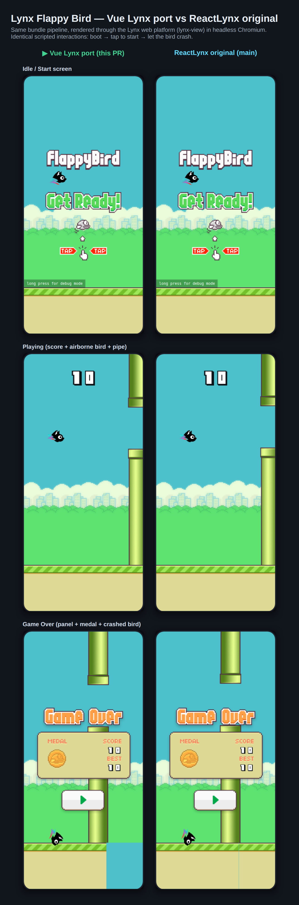

# Vue Lynx port — web verification

Side-by-side verification that the **Vue Lynx port** behaves identically to the
**ReactLynx original**, both rendered through the Lynx **web platform**
(`<lynx-view>` + `@lynx-js/web-platform`) in headless Chromium.

## Method

1. Built each edition's web bundle (`rspeedy build`) and embedded it in the
   website shell (`rspeedy build && cd website && rsbuild build`), with
   `VERCEL=1` so every asset prefix is root-relative for local serving.
2. Served each `website/dist` from a local static server that sets
   `Cross-Origin-Opener-Policy: same-origin` and
   `Cross-Origin-Embedder-Policy: require-corp` (required for the Lynx
   main-thread worker runtime / `SharedArrayBuffer`).
3. Drove both with the **same scripted interactions** in Playwright Chromium:
   boot → tap to start → flap → let the bird crash.

## Result

| State | Outcome |
| --- | --- |
| Idle / start screen | Pixel-identical (title, "Get Ready!", bird bob, TAP hints, debug hint) |
| Playing | Pixel-identical (score `10`, airborne tilted bird, pipe entering, ground scroll) |
| Game Over | Pixel-identical (panel, bronze medal, SCORE/BEST `10`, crashed-bird pose) |

Runtime logs confirmed the ported main-thread code actually executes on web:
`onWindowResize` (the `GlobalEventEmitter` port of `useLynxGlobalEventListener`)
and the MTS `applyLayout` responsive relayout both fired, with
`crossOriginIsolated === true` and no runtime errors.
